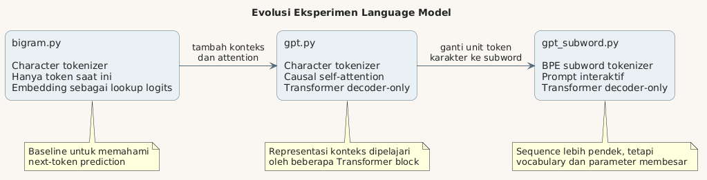
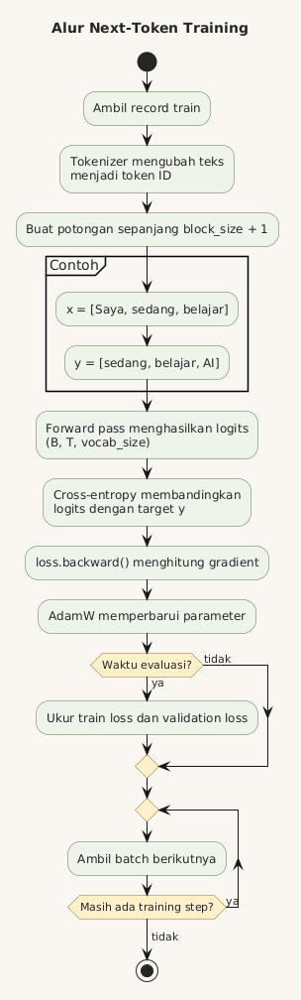
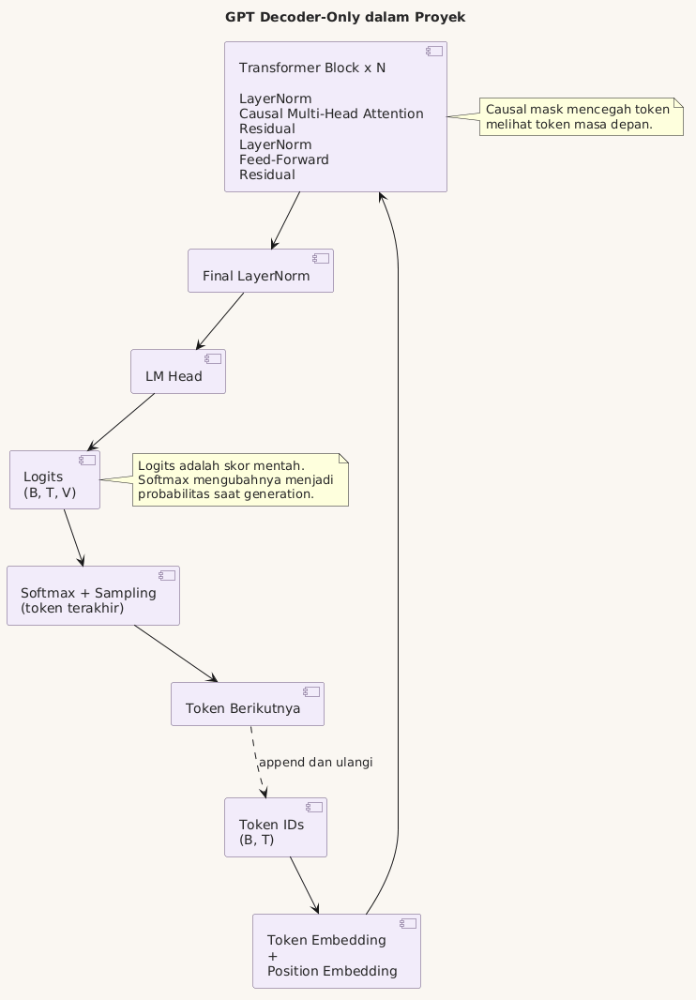
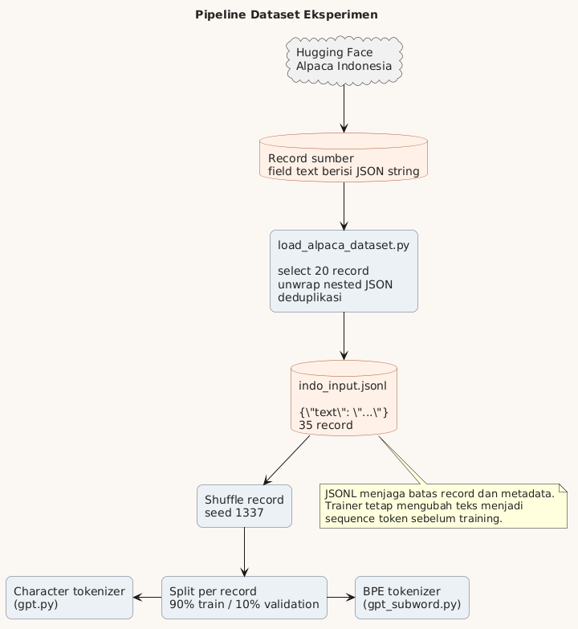

# Membangun Language Model Kecil dari Nol

## Dari Bigram ke GPT Subword

Dokumen ini merangkum eksperimen pertama membangun language model.

Fokusnya bukan mengejar model besar.

Fokusnya memahami alur lengkap:

```text
dataset -> tokenizer -> batch -> model -> loss -> gradient -> generation
```

Kode utama yang dibahas:

- `bigram.py`
- `gpt.py`
- `gpt_subword.py`
- `load_alpaca_dataset.py`

Basic yang diasumsikan:

- Pernah memakai CNN, LSTM, ViT, atau BERT.
- Memahami tensor dan training loop secara umum.
- Tidak memerlukan matematika berat untuk mengikuti penjelasan.

### Cara membaca materi ini

Mulai dari versi intuitifnya.

Lalu lihat equation.

Setiap equation akan dibaca dengan urutan:

1. Apa tujuan equation tersebut?
2. Apa arti setiap simbolnya?
3. Apa bentuk tensor yang masuk dan keluar?
4. Apa interpretasinya dalam bahasa biasa?
5. Baris kode mana yang mengimplementasikannya?

Equation bukan hiasan.

Equation adalah spesifikasi ringkas dari operasi yang dilakukan kode.

### Kamus istilah awal

**Token** adalah unit teks yang diproses model.

Token dapat berupa karakter, potongan kata, kata, atau byte.

**Vocabulary** adalah daftar seluruh token yang dikenali tokenizer.

**Tokenizer** adalah aturan yang mengubah teks menjadi token ID dan sebaliknya.

**Token ID** adalah nomor integer yang mewakili sebuah token.

**Embedding** adalah vektor angka yang dipelajari untuk merepresentasikan token.

**Context** adalah token-token sebelumnya yang tersedia saat membuat prediksi.

**Logit** adalah skor mentah model untuk satu kandidat token.

Logit belum merupakan probabilitas.

**Probability** atau probabilitas adalah angka antara 0 dan 1.

Jumlah probabilitas seluruh kandidat token adalah 1.

**Loss** adalah angka yang mengukur seberapa salah prediksi model.

**Gradient** menunjukkan arah dan besar perubahan parameter untuk menurunkan loss.

**Parameter** adalah angka di dalam model yang dipelajari selama training.

**Layer** adalah satu tahap transformasi tensor.

**Block** adalah kumpulan layer yang menjadi satu unit berulang dalam Transformer.

Dalam proyek ini, satu block berisi attention, feed-forward, normalization, dan residual connection.

**Attention** adalah mekanisme untuk mencampur informasi antar-token berdasarkan relevansinya.

**Attention head** adalah satu jalur attention dengan proyeksi Query, Key, dan Value miliknya sendiri.

**Multi-head attention** adalah beberapa attention head yang berjalan paralel.

**Decoder-only** adalah Transformer yang memprediksi token berikutnya dengan hanya melihat token sebelumnya.

---

## 1. Tujuan Language Model

Language model belajar memprediksi token berikutnya.

Contoh:

```text
Input  : Saya sedang belajar
Target : AI
```

Model tidak langsung menulis satu paragraf.

Model hanya melakukan satu langkah:

$$
P(x_t \mid x_{<t})
$$

### Cara membaca equation

**Tujuan:** menghitung probabilitas token pada posisi sekarang.

**Simbol:**

- $P$ berarti probability atau probabilitas.
- $x_t$ adalah token yang ingin diprediksi pada posisi $t$.
- $t$ adalah indeks posisi dalam sequence.
- $x_{<t}$ berarti seluruh token sebelum posisi $t$.
- Garis vertikal $\mid$ dibaca "dengan mengetahui" atau "dikondisikan pada".

Equation itu dibaca:

> Probabilitas token $x_t$, dengan mengetahui semua token sebelum posisi $t$.

Contoh:

```text
x_<t = "Saya sedang belajar"
x_t  = "AI"
```

Model menghitung seberapa mungkin `AI` muncul setelah `Saya sedang belajar`.

Model sebenarnya menghitung probabilitas untuk seluruh vocabulary.

```text
P("AI")      = 0,35
P("di")      = 0,15
P("membuat") = 0,10
...
```

### Probabilitas seluruh sequence

Probabilitas sebuah sequence dapat dipecah menjadi prediksi token demi token:

$$
P(x_1, x_2, \ldots, x_T)
= \prod_{t=1}^{T} P(x_t \mid x_{<t})
$$

**Simbol:**

- $T$ adalah jumlah token dalam sequence.
- $\prod$ berarti mengalikan hasil untuk setiap posisi.
- Setiap faktor adalah probabilitas satu token berdasarkan token sebelumnya.

**Interpretasi:**

Model tidak perlu memprediksi seluruh kalimat sekaligus.

Ia cukup belajar banyak prediksi token berikutnya.

Gabungan prediksi lokal tersebut membentuk probabilitas seluruh teks.

Setelah satu token dipilih, token itu ditambahkan ke input.

Proses kemudian diulang.

```text
Saya sedang belajar
Saya sedang belajar AI
Saya sedang belajar AI dari
Saya sedang belajar AI dari nol
```

Inilah arti **autoregressive generation**.

---

## 2. Evolusi Eksperimen



Ada tiga tahap model.

| File | Tokenizer | Konteks | Model |
|---|---|---|---|
| `bigram.py` | Karakter | Praktis satu token | Lookup table |
| `gpt.py` | Karakter | Banyak token sebelumnya | Transformer |
| `gpt_subword.py` | BPE subword | Banyak subword sebelumnya | Transformer |

Perubahan pertama adalah kemampuan melihat konteks.

Perubahan kedua adalah unit token.

Arsitektur `gpt.py` dan `gpt_subword.py` hampir sama.

Yang paling berbeda adalah tokenizer dan ukuran vocabulary.

---

## 3. Dataset Menjadi Token

Model neural network tidak menerima string.

Model menerima integer.

```text
"Saya belajar"
      ↓ tokenizer
[50, 12874, 1689]
```

Integer tersebut adalah ID token.

ID token kemudian masuk ke embedding table.

### Tokenizer bukan Transformer encoder

Di `gpt_subword.py` terdapat:

```python
enc.encode(text)
```

Nama `encode` kadang membingungkan.

Ini hanya tokenisasi.

Ia bukan encoder seperti encoder pada BERT.

Ia tidak memahami makna kalimat.

Pemahaman dipelajari oleh parameter Transformer.

---

## 4. `bigram.py`: Baseline Paling Sederhana

Bigram model melihat token saat ini.

Lalu memprediksi token berikutnya.

```text
token sekarang -> probabilitas token berikutnya
```

Bagian intinya:

```python
self.token_embedding_table = nn.Embedding(vocab_size, vocab_size)
```

Biasanya embedding menghasilkan representasi tersembunyi.

Di model bigram ini, setiap baris langsung menjadi logits.

Jika vocabulary berisi 65 karakter:

```text
input token ID
      ↓
lookup satu baris berisi 65 skor
      ↓
probabilitas 65 kandidat karakter berikutnya
```

### Keterbatasannya

Bigram tidak benar-benar menggunakan sejarah panjang.

Prediksi berikut ini dianggap sama:

```text
"Saya makan nasi"
"Kucing melihat nasi"
```

Jika token terakhir sama-sama `i`, bigram hanya melihat `i`.

Konteks sebelumnya hilang.

Karena itu hasilnya cepat belajar bentuk lokal.

Tetapi sulit menjaga kalimat panjang tetap konsisten.

---

## 5. Input dan Target yang Digeser

Training data dibuat dengan menggeser target satu token.

```text
tokens = [Saya, sedang, belajar, AI]

x = [Saya, sedang, belajar]
y = [sedang, belajar, AI]
```

Pada setiap posisi:

```text
Saya                  -> sedang
Saya sedang           -> belajar
Saya sedang belajar   -> AI
```

Satu sequence memberikan beberapa contoh training sekaligus.

`block_size` menentukan panjang maksimum sequence itu.

`batch_size` menentukan berapa sequence independen diproses bersama.



---

## 6. Bentuk Tensor Utama

Notasi yang sering muncul:

```text
B = batch size
T = time atau sequence length
C = channel atau embedding dimension
V = vocabulary size
```

Input token:

```text
idx.shape = (B, T)
```

Setelah embedding:

```text
x.shape = (B, T, C)
```

Setelah LM head:

```text
logits.shape = (B, T, V)
```

Ini mirip cara ViT mengubah patch menjadi embedding.

Bedanya:

```text
ViT : patch gambar -> embedding
GPT : token teks   -> embedding
```

Keduanya lalu memproses sequence embedding dengan Transformer.

---

## 7. `gpt.py`: Character-Level Transformer

`gpt.py` masih menggunakan karakter sebagai token.

Tetapi modelnya bukan bigram lagi.

Ia sudah memiliki:

- Token embedding.
- Position embedding.
- Multi-head self-attention.
- Causal mask.
- Feed-forward network.
- Residual connection.
- LayerNorm.
- LM head.

### Apa itu Transformer block?

Transformer block adalah unit pemrosesan yang diulang beberapa kali.

Di `gpt.py`:

```python
self.blocks = nn.Sequential(
    *[Block(n_embd, n_head=n_head) for _ in range(n_layer)]
)
```

Jika `n_layer = 4`, ada empat block berurutan.

Satu block menerima tensor `(B, T, C)`.

Block juga mengeluarkan tensor `(B, T, C)`.

Bentuknya sengaja tetap sama.

Karena itu block dapat ditumpuk.

Isi satu block:

```text
input
-> LayerNorm
-> multi-head attention
-> residual addition
-> LayerNorm
-> feed-forward network
-> residual addition
-> output
```

Interpretasinya:

- Attention memungkinkan token saling bertukar informasi.
- Feed-forward memproses informasi pada setiap token.
- Residual menjaga informasi lama tetap memiliki jalur langsung.
- LayerNorm membantu kestabilan aktivasi dan training.



### Token embedding

```python
self.token_embedding_table = nn.Embedding(vocab_size, n_embd)
```

Token ID diubah menjadi vektor berukuran `n_embd`.

Vektor ini dipelajari selama training.

Karakter `a` tidak memiliki embedding bermakna di awal.

Maknanya terbentuk melalui gradient update.

### Position embedding

```python
self.position_embedding_table = nn.Embedding(block_size, n_embd)
```

Self-attention sendiri tidak mengetahui urutan.

Position embedding memberi informasi posisi token.

```text
token embedding + position embedding
```

Analogi sederhananya:

```text
apa tokennya + token itu berada di mana
```

---

## 8. Self-Attention

Self-attention membuat satu token membaca token lain.

**Definisi attention:** mekanisme yang menghitung seberapa relevan token-token
lain, lalu mencampur informasinya memakai bobot relevansi tersebut.

**Definisi self-attention:** Query, Key, dan Value semuanya berasal dari sequence
yang sama.

Kata `self` merujuk pada sumber yang sama.

Bukan berarti model memiliki kesadaran diri.

Setiap token menghasilkan tiga representasi:

```text
Query  : apa yang sedang saya cari?
Key    : informasi apa yang saya miliki?
Value  : isi apa yang akan saya berikan?
```

### Membentuk Query, Key, dan Value

Dari input embedding $X$, model membuat tiga proyeksi linear:

$$
Q = XW_Q
$$

$$
K = XW_K
$$

$$
V = XW_V
$$

**Simbol:**

- $X$ adalah representasi token yang masuk ke attention.
- $W_Q$ adalah parameter proyeksi Query.
- $W_K$ adalah parameter proyeksi Key.
- $W_V$ adalah parameter proyeksi Value.
- $Q$, $K$, dan $V$ adalah tensor hasil proyeksi.

Huruf $W$ biasa dipakai untuk weight atau bobot parameter.

Ketiga matriks $W$ dipelajari saat training.

Di kode:

```python
k = self.key(x)
q = self.query(x)
v = self.value(x)
```

Jika input memiliki bentuk:

```text
X = (B, T, C)
```

Maka dalam satu head:

```text
Q = (B, T, head_size)
K = (B, T, head_size)
V = (B, T, head_size)
```

### Equation scaled dot-product attention

Versi ringkas attention:

$$
\operatorname{Attention}(Q,K,V)
= \operatorname{softmax}\left(
\frac{QK^\top + M}{\sqrt{d_k}}
\right)V
$$

Equation ini dapat dipecah menjadi lima langkah.

### 1. Menghitung kecocokan Query dan Key

$$
S = QK^\top
$$

**Simbol:**

- $S$ adalah attention score sebelum scaling dan softmax.
- $K^\top$ adalah Key yang ditranspose pada dua dimensi terakhir.
- Operator perkalian adalah matrix multiplication.

**Bentuk tensor:**

```text
Q   : (B, T, head_size)
K^T : (B, head_size, T)
S   : (B, T, T)
```

**Interpretasi:**

Setiap posisi membandingkan Query miliknya dengan Key milik setiap posisi.

Nilai besar berarti pasangan tersebut lebih cocok menurut parameter saat ini.

### 2. Melakukan scaling

$$
S_{scaled} = \frac{S}{\sqrt{d_k}}
$$

**Simbol:**

- $d_k$ adalah ukuran dimensi Key dalam satu head.
- Pada kode, $d_k$ sama dengan `head_size`.
- $\sqrt{d_k}$ adalah akar kuadrat dari ukuran head.

**Interpretasi:**

Dot product cenderung membesar ketika dimensinya membesar.

Skor yang terlalu besar membuat softmax terlalu tajam.

Scaling menjaga distribusi lebih stabil.

Di kode:

```python
wei = q @ k.transpose(-2, -1) * k.shape[-1] ** -0.5
```

Perkalian dengan $d_k^{-0.5}$ sama dengan pembagian oleh $\sqrt{d_k}$.

### 3. Menambahkan causal mask

$$
S_{masked} = S_{scaled} + M
$$

**Simbol:**

- $M$ adalah causal mask.
- Posisi yang boleh dilihat mendapat nilai 0.
- Posisi masa depan mendapat nilai $-\infty$.

Contoh mask untuk empat token:

$$
M =
\begin{bmatrix}
0 & -\infty & -\infty & -\infty \\
0 & 0 & -\infty & -\infty \\
0 & 0 & 0 & -\infty \\
0 & 0 & 0 & 0
\end{bmatrix}
$$

**Interpretasi per baris:**

- Token pertama hanya dapat melihat token pertama.
- Token kedua dapat melihat token pertama dan kedua.
- Token ketiga dapat melihat tiga token pertama.
- Token keempat dapat melihat seluruh token sampai posisinya.

### 4. Mengubah skor menjadi bobot

$$
A = \operatorname{softmax}(S_{masked})
$$

**Simbol:**

- $A$ adalah attention weights.
- Setiap baris $A$ berjumlah 1.
- Nilainya berada antara 0 dan 1.

Softmax untuk sebuah vektor skor $z$:

$$
\operatorname{softmax}(z_i)
= \frac{e^{z_i}}{\sum_j e^{z_j}}
$$

**Simbol:**

- $z_i$ adalah skor kandidat ke-$i$.
- $e$ adalah bilangan Euler, basis fungsi eksponensial.
- $\sum_j$ berarti menjumlahkan seluruh kandidat.

**Interpretasi:**

Softmax mengubah skor relatif menjadi distribusi bobot.

Posisi dengan skor lebih besar mendapatkan bobot lebih besar.

Skor $-\infty$ pada masa depan menjadi bobot 0.

### 5. Menggabungkan Value

$$
O = AV
$$

**Simbol:**

- $O$ adalah output satu attention head.
- $A$ adalah bobot attention `(B, T, T)`.
- $V$ adalah informasi yang akan dicampur `(B, T, head_size)`.

**Bentuk output:**

```text
O = (B, T, head_size)
```

**Interpretasi:**

Setiap token mendapatkan weighted sum dari Value token-token yang boleh dilihat.

Attention score menentukan **dari mana membaca**.

Value menentukan **informasi apa yang dibawa**.

Bagian utamanya:

```python
wei = q @ k.transpose(-2, -1) * k.shape[-1] ** -0.5
```

`q @ k.T` menghasilkan skor hubungan antarposisi.

Bentuknya:

```text
(B, T, head_size) @ (B, head_size, T)
                   ↓
               (B, T, T)
```

Setiap token mendapatkan skor terhadap semua token lain.

### Scaling

```python
* head_size ** -0.5
```

Scaling menjaga skor tidak terlalu besar.

Tanpa scaling, softmax bisa terlalu tajam.

Satu token bisa mendapatkan probabilitas hampir satu terlalu cepat.

### Causal mask

```python
wei = wei.masked_fill(tril == 0, float('-inf'))
```

Token tidak boleh melihat masa depan.

Saat memprediksi token ketiga:

```text
boleh melihat : token pertama dan kedua
tidak boleh   : token keempat dan seterusnya
```

Nilai `-inf` menjadi probabilitas nol setelah softmax.

---

## 9. Multi-Head Attention

Satu attention head mempelajari satu ruang hubungan.

**Definisi head:** satu set proyeksi $W_Q$, $W_K$, dan $W_V$, diikuti proses
scaled dot-product attention.

Head bukan satu neuron.

Head adalah satu jalur attention lengkap.

Beberapa head berjalan paralel.

**Definisi multi-head attention:** menjalankan beberapa head pada input yang
sama, menggabungkan outputnya, lalu memproyeksikan hasil gabungan.

Equation ringkas:

$$
\operatorname{MultiHead}(X)
= \operatorname{Concat}(head_1, \ldots, head_h)W_O
$$

Dengan:

$$
head_i = \operatorname{Attention}(Q_i,K_i,V_i)
$$

**Simbol:**

- $h$ adalah jumlah attention head.
- $head_i$ adalah output head ke-$i$.
- $\operatorname{Concat}$ menggabungkan tensor pada dimensi channel.
- $W_O$ adalah output projection yang mencampur hasil seluruh head.

**Bentuk tensor pada konfigurasi sekarang:**

```text
input X             : (B, T, 128)
output setiap head  : (B, T, 32)
empat head          : 4 x (B, T, 32)
setelah concat      : (B, T, 128)
setelah W_O         : (B, T, 128)
```

```python
torch.cat([h(x) for h in self.heads], dim=-1)
```

Secara intuitif, head berbeda dapat fokus pada pola berbeda.

Contohnya:

- Hubungan subjek dan kata kerja.
- Token yang mengawali paragraf.
- Nama entitas yang disebut sebelumnya.
- Pola tanda baca.

Interpretasi head tidak selalu sesederhana itu.

Namun analogi tersebut cukup membantu.

Syarat implementasi saat ini:

```text
n_embd harus habis dibagi n_head
```

Dengan:

```text
n_embd = 128
n_head = 4
```

Maka ukuran setiap head adalah 32.

---

## 10. Feed-Forward dan Residual

Attention adalah tahap komunikasi antar-token.

Feed-forward adalah tahap komputasi per-token.

```python
Linear(n_embd, 4 * n_embd)
ReLU
Linear(4 * n_embd, n_embd)
```

Setiap posisi melewati MLP yang sama.

Residual connection mempertahankan jalur informasi:

```python
x = x + attention(...)
x = x + feed_forward(...)
```

Konsep ini sama seperti skip connection pada ResNet.

LayerNorm membantu menjaga aktivasi tetap stabil.

---

## 11. Decoder-Only vs BERT

Basic BERT sangat membantu untuk memahami perbedaannya.

| BERT | GPT |
|---|---|
| Encoder-only | Decoder-only |
| Melihat kiri dan kanan | Hanya melihat token sebelumnya |
| Masked language modeling | Next-token prediction |
| Cocok untuk representasi/klasifikasi | Cocok untuk generation |

Istilah decoder-only berasal dari Transformer original.

GPT tidak memiliki encoder dan cross-attention.

Ia hanya menggunakan causal self-attention.

---

## 12. Loss dan Backpropagation

LM head menghasilkan logits.

Logits adalah skor mentah.

Misalnya vocabulary hanya memiliki tiga token:

```text
logits = [2.1, 0.3, -1.0]
token  = ["AI", "di", "dan"]
```

Logit dapat bernilai negatif atau lebih besar dari 1.

Karena itu logit bukan probabilitas.

Softmax mengubah logits menjadi probabilitas.

### Cross-entropy loss

Untuk satu target token, loss dapat ditulis:

$$
L_t = -\log P(x_t \mid x_{<t})
$$

**Simbol:**

- $L_t$ adalah loss pada posisi $t$.
- $P(x_t \mid x_{<t})$ adalah probabilitas yang diberikan model kepada token target.
- $\log$ adalah logaritma natural.
- Tanda minus membuat probabilitas tinggi menghasilkan loss kecil.

**Interpretasi angka:**

```text
probabilitas target tinggi -> loss kecil
probabilitas target rendah -> loss besar
```

Contoh:

```text
P(target) = 0,90 -> -log(0,90) sekitar 0,11
P(target) = 0,10 -> -log(0,10) sekitar 2,30
P(target) = 0,01 -> -log(0,01) sekitar 4,61
```

Model dihukum lebih besar ketika sangat tidak yakin pada jawaban yang benar.

Untuk seluruh batch dan sequence:

$$
L = -\frac{1}{BT}
\sum_{b=1}^{B}\sum_{t=1}^{T}
\log P(x_{b,t} \mid x_{b,<t})
$$

**Simbol:**

- $B$ adalah jumlah sequence dalam batch.
- $T$ adalah jumlah posisi dalam setiap sequence.
- $x_{b,t}$ adalah target pada batch ke-$b$ dan posisi ke-$t$.
- $BT$ adalah jumlah prediksi token yang dirata-ratakan.
- $\sum$ berarti menjumlahkan loss semua posisi.

**Interpretasi:**

Satu angka loss merangkum kesalahan banyak prediksi token.

Loss kecil berarti rata-rata model memberi probabilitas lebih tinggi kepada target benar.

Namun loss kecil pada train set belum menjamin generalisasi.

```python
loss = F.cross_entropy(logits, targets)
```

Cross-entropy memberi penalti ketika target mendapat probabilitas kecil.

PyTorch menghitung `log_softmax` dan negative log-likelihood secara stabil.

Kita tidak perlu memanggil softmax terlebih dahulu saat training.

### Backpropagation

Backpropagation menghitung pengaruh setiap parameter terhadap loss.

Secara ringkas:

$$
g = \nabla_{\theta} L
$$

**Simbol:**

- $\theta$ mewakili seluruh parameter model.
- $L$ adalah loss.
- $\nabla_{\theta}L$ adalah gradient loss terhadap parameter.
- $g$ adalah kumpulan gradient yang dihasilkan.

**Interpretasi:**

Gradient menjawab pertanyaan:

> Jika parameter ini diubah sedikit, loss bergerak ke arah mana dan seberapa kuat?

`loss.backward()` menghitung gradient tersebut memakai computation graph PyTorch.

### Optimizer update

Versi paling sederhana, gradient descent:

$$
\theta_{new} = \theta_{old} - \eta \nabla_{\theta}L
$$

**Simbol:**

- $\theta_{old}$ adalah parameter sebelum update.
- $\theta_{new}$ adalah parameter setelah update.
- $\eta$ adalah learning rate.
- Gradient dikurangkan agar loss bergerak turun.

Kode memakai AdamW, bukan gradient descent polos.

AdamW menyimpan moving average gradient dan squared gradient.

Namun interpretasi utamanya tetap sama:

```text
gradient memberi arah
learning rate mengatur besar langkah
optimizer menerapkan update
```

Saat training:

```python
optimizer.zero_grad(set_to_none=True)
loss.backward()
optimizer.step()
```

Urutannya:

```text
hapus gradient lama
-> hitung gradient baru
-> perbarui parameter
```

Parameter yang diperbarui mencakup:

- Embedding.
- Proyeksi Q, K, dan V.
- Attention output projection.
- Feed-forward layers.
- LayerNorm.
- LM head.

Jadi bukan hanya "decoder bagian akhir" yang dilatih.

Seluruh model dilatih end-to-end.

---

## 13. Generation

Saat generation, model hanya memakai logits posisi terakhir.

**Definisi generation:** proses memakai model yang sudah dilatih untuk membuat
token baru secara autoregresif.

**Definisi sampling:** memilih token berdasarkan distribusi probabilitas,
bukan selalu mengambil token dengan probabilitas tertinggi.

```python
logits = logits[:, -1, :]
probs = F.softmax(logits, dim=-1)
idx_next = torch.multinomial(probs, num_samples=1)
```

Langkahnya:

```text
logits
-> softmax
-> probabilitas token
-> sampling satu token
-> append ke context
-> ulangi
```

Model tidak mengambil kalimat utuh dari database.

Ia membentuk teks token demi token.

Kualitas generation dipengaruhi oleh:

- Kualitas model.
- Dataset.
- Context prompt.
- Temperature.
- Top-k atau top-p.
- Panjang konteks.

Implementasi saat ini memakai sampling langsung.

Temperature dan top-k/top-p belum ditambahkan.

---

## 14. `gpt_subword.py`: Dari Karakter ke BPE

Character tokenizer memiliki vocabulary kecil.

Tetapi sequence menjadi panjang.

```text
"belajar" -> b, e, l, a, j, a, r
```

Subword tokenizer dapat menghasilkan potongan yang lebih besar.

```text
"belajar" -> satu atau beberapa subword
```

Keuntungannya:

- Sequence lebih pendek.
- Pola kata dapat dipelajari lebih langsung.
- Lebih cocok untuk model modern multilingual.

Trade-off-nya:

- Vocabulary lebih besar.
- Token embedding lebih besar.
- LM head lebih besar.

### Mengapa parameter langsung naik?

Ukuran token embedding:

```text
vocab_size x n_embd
```

Ukuran LM head hampir sama:

```text
n_embd x vocab_size
```

Dengan vocabulary sekitar 50 ribu dan `n_embd = 128`:

```text
embedding sekitar 6,4 juta parameter
LM head   sekitar 6,4 juta parameter
```

Dua matriks tersebut sudah sekitar 12,8 juta parameter.

Karena itu model subword tercatat sekitar 13,7 juta parameter.

### Catatan encoding saat ini

Kode aktif saat ini memakai:

```python
enc = tiktoken.get_encoding('gpt2')
```

`cl100k_base` masih tersedia sebagai komentar.

`cl100k_base` lebih modern dan multilingual.

Namun vocabulary-nya sekitar 100 ribu.

Parameter embedding dan LM head akan lebih besar lagi.

Untuk Gatra kecil, tokenizer BPE Indonesia sendiri lebih masuk akal.

---

## 15. Dataset JSONL

Dataset awal berupa satu file teks panjang.

Eksperimen berikutnya memakai JSON Lines:

```json
{"text":"Saya sedang belajar neural network."}
{"text":"Model ini melakukan next-token prediction."}
```

Satu baris adalah satu objek JSON.

Keuntungannya:

- Batas record tetap jelas.
- Bisa menyimpan metadata.
- Mudah dibaca secara streaming.
- Mudah dideduplikasi.
- Mudah dipisah per sumber atau domain.

JSONL bukan bentuk akhir yang masuk ke GPU.

Trainer tetap mengambil field `text`.

Teks kemudian ditokenisasi menjadi sequence integer.

---

## 16. Shuffle dan Train/Validation Split

Record diacak dengan seed tetap:

```python
random.Random(1337).shuffle(records)
```

Yang diacak adalah urutan record.

Bukan karakter.

Bukan token di dalam kalimat.

Jika token diacak, struktur bahasa akan rusak.

Split dilakukan pada level record:

```python
record_split = int(0.9 * len(records))
```

Ini lebih aman daripada menggabungkan semua teks lalu memotong di tengah.

Satu record hanya berada di train atau validation.

Tujuannya mengurangi leakage.

---

## 17. `load_alpaca_dataset.py`

Script ini mengambil 20 sampel dari Hugging Face:

```python
load_dataset(
    "AnnasBlackHat/alpaca-indonesia-llama",
    split="train",
)
```

Dataset sumber memiliki struktur agak unik.

Field `text` berisi JSON string lagi.

Karena itu perlu di-unwrap:

```python
json.loads(row["text"])["text"]
```

Script kemudian:

1. Memilih 20 record.
2. Mengubahnya menjadi `{"text": ...}`.
3. Membaca data yang sudah ada.
4. Menghapus calon duplikasi.
5. Menambahkan record baru ke `indo_input.jsonl`.



### Idempotent sederhana

Script menyimpan semua teks lama dalam sebuah set:

```python
seen = {record["text"] for record in existing}
```

Record yang sudah ada tidak ditambahkan lagi.

Jadi script dapat dijalankan ulang tanpa terus menggandakan 20 record yang sama.

---

## 18. Alpaca dan Instruction Tuning

Record Alpaca memiliki pola:

```text
### Human: pertanyaan
### Assistant: jawaban
```

Alpaca dibuat untuk instruction tuning.

Ia bukan dataset base pretraining murni.

`### Human:` dan `### Assistant:` saat ini hanya teks biasa.

Keduanya bukan special token.

Tokenizer akan memecahnya menjadi beberapa token.

### Menuju format chat yang lebih baik

Format penyimpanan modern biasanya memakai `messages`:

```json
{
  "messages": [
    {"role": "user", "content": "Apa ibu kota Indonesia?"},
    {"role": "assistant", "content": "Ibu kota Indonesia adalah Jakarta."}
  ]
}
```

Chat template kemudian mengubahnya menjadi sequence.

Contohnya:

```text
<|im_start|>user
Apa ibu kota Indonesia?<|im_end|>
<|im_start|>assistant
Ibu kota Indonesia adalah Jakarta.<|im_end|>
```

Special token harus didaftarkan di tokenizer.

Menulis string yang terlihat khusus belum membuatnya menjadi satu token khusus.

---

## 19. Base Pretraining vs SFT

Saat ini semua record diratakan menjadi teks.

Loss dihitung pada semua token.

Ini cukup untuk eksperimen pipeline.

Namun tahap serius sebaiknya dipisahkan.

### Base pretraining

Dataset:

```json
{"text":"Artikel, buku, cerita, kode, atau dokumen."}
```

Loss dihitung pada semua token.

Tujuannya belajar bahasa dan pengetahuan umum.

### Supervised fine-tuning

Dataset:

```json
{"messages":[...]}
```

Token system dan user biasanya tidak dihitung dalam loss.

Labelnya diubah menjadi `-100`.

Token assistant tetap dihitung.

```text
user prompt       -> label -100
assistant answer  -> label token asli
```

Tujuannya mengajarkan model cara menjawab.

---

## 20. Membaca Train dan Validation Loss

Eksperimen subword menghasilkan pola seperti:

```text
train loss turun terus
validation loss turun lalu stagnan/naik
```

Ini menunjukkan overfitting.

Model semakin bagus mengingat train set.

Tetapi kemampuan pada record validation tidak ikut membaik.

Dataset hanya puluhan record.

Model memiliki jutaan parameter.

Rasionya sangat tidak seimbang.

Karena itu output mencampur fragmen:

- Julius Caesar.
- Atom.
- Commodore 64.
- Format `### Human`.
- Potongan kalimat buatan sendiri.

Pipeline bekerja.

Model hanya belum memiliki data cukup untuk generalisasi.

---

## 21. CUDA dan Python

Kode model ditulis dalam Python.

Namun operasi berat tidak dihitung oleh interpreter Python.

```text
Python/PyTorch
-> C++ runtime
-> CUDA/cuBLAS kernels
-> RTX 4060
```

Contoh:

```python
q @ k.transpose(-2, -1)
```

Python mendeskripsikan operasi.

GPU menjalankan matrix multiplication.

Ini alasan Python tetap umum untuk riset model.

Riset cepat ditulis.

Komputasi berat tetap berjalan di native code.

---

## 22. Apa yang Sudah Berhasil?

- Environment dikelola dengan `uv`.
- PyTorch CUDA terdeteksi pada RTX 4060.
- Bigram model berhasil dilatih.
- Character-level GPT berhasil dilatih.
- Subword GPT berhasil dilatih.
- Prompt interaktif berhasil dipakai saat generation.
- Dataset berpindah dari TXT ke JSONL.
- Record di-shuffle dan di-split secara reproducible.
- Sampel Alpaca Indonesia berhasil dimuat.
- Train dan validation loss dapat dipantau.
- Overfitting pada dataset kecil berhasil diamati secara nyata.

Ini sudah merupakan pipeline language model end-to-end.

Masih kecil.

Tetapi setiap komponen intinya sudah terlihat.

---

## 23. Keterbatasan Implementasi Saat Ini

- Dataset sangat kecil.
- Data pretraining dan instruction masih tercampur.
- Tokenizer belum dilatih khusus Indonesia.
- Belum ada checkpoint dan resume.
- Belum ada mixed precision.
- Belum ada learning-rate scheduler.
- Belum ada temperature, top-k, atau top-p.
- Belum ada assistant-only loss masking.
- Belum ada weight tying.
- Position embedding masih learned absolute embedding.
- Feed-forward masih memakai ReLU.
- Attention belum memakai optimized SDPA/Flash Attention API.
- Evaluasi baru berfokus pada loss dan contoh output.

Keterbatasan ini bukan kegagalan.

Ini daftar eksperimen berikutnya.

---

## 24. Arah Gatra

Gatra diposisikan sebagai general-purpose language model.

Arah yang masuk akal:

> Indonesia-first, bilingual small language model untuk reasoning dan tool use.

Dua track dapat berjalan bersama.

### Track riset

```text
Gatra-1M
-> Gatra-10M
-> Gatra-30M
-> Gatra-100M
```

Model dilatih dari nol.

Tujuannya memahami tokenizer, arsitektur, data, scaling, dan training dynamics.

### Track produk

```text
pretrained model 0.5B-3B
-> continued pretraining Indonesia
-> SFT
-> preference optimization
-> tools/RAG
-> quantization
```

Jalur ini lebih cepat menghasilkan model yang berguna.

---

## 25. Langkah Berikutnya

Urutan yang paling masuk akal:

1. Pisahkan `pretrain.jsonl` dan `sft.jsonl`.
2. Latih tokenizer BPE Indonesia 8k atau 16k.
3. Tambahkan checkpoint dan resume.
4. Tambahkan batas waktu mode `smoke`, `study`, dan `run`.
5. Tambahkan metrics token per detik dan penggunaan VRAM.
6. Tambahkan temperature, top-k, dan top-p.
7. Tambahkan weight tying.
8. Modernisasi ke RoPE, RMSNorm, dan SwiGLU.
9. Buat Gatra-10M sebagai baseline.
10. Bandingkan Gatra-30M pada token budget yang sama.

Target dekatnya bukan model frontier.

Target dekatnya adalah eksperimen yang dapat dijelaskan.

Setiap perubahan harus menjawab satu pertanyaan.

Setiap hasil harus dapat dibandingkan dengan baseline.

---

## Penutup

Bigram mengajarkan inti probabilitas token berikutnya.

GPT karakter menambahkan konteks dan self-attention.

GPT subword mengganti unit bahasa menjadi potongan yang lebih efisien.

JSONL dan loader Alpaca mulai memperkenalkan data engineering.

Train/validation loss memperkenalkan evaluasi dan overfitting.

Semua model tersebut tetap memiliki inti yang sama:

```text
lihat token sebelumnya
-> hitung logits
-> prediksi token berikutnya
-> belajar dari kesalahan
-> ulangi
```

Skala dapat berubah dari ribuan menjadi miliaran parameter.

Prinsip dasarnya tetap dapat ditelusuri dari kode kecil ini.
